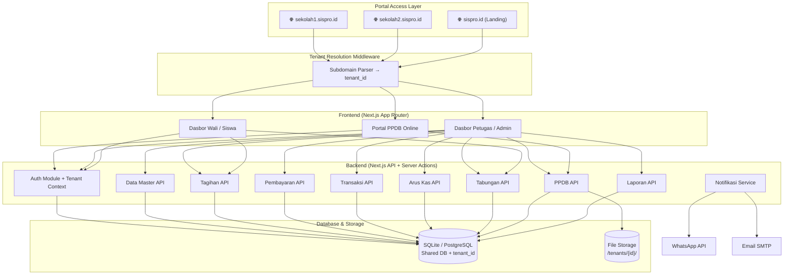
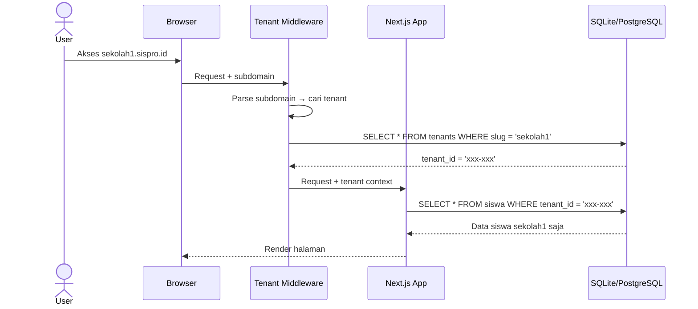
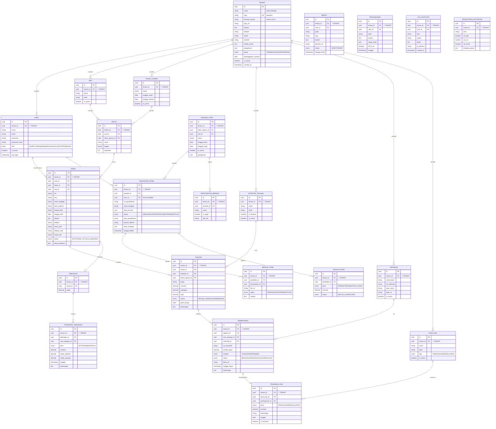

# 🏫 SISPRO — Sistem Informasi Sekolah Profesional

> Rencana Implementasi Lengkap Aplikasi Manajemen Sekolah All-in-One — **SaaS-Ready Architecture**

## Ringkasan Proyek

SISPRO adalah aplikasi Sistem Informasi Sekolah berbasis web yang mencakup pengelolaan data master, tagihan & pembayaran, arus kas, tabungan siswa, PPDB Online, pelaporan, hingga portal berita & pengumuman. Aplikasi ini memiliki **3 portal utama**: Dasbor Petugas (Admin), Dasbor Wali/Siswa, dan Portal PPDB Online.

> [!TIP]
> **Arsitektur SaaS-Ready (Opsi B)** — Sistem dibangun dengan multi-tenant architecture dari awal menggunakan strategi **Shared DB + Tenant ID**. Setiap tabel memiliki `tenant_id` sehingga migrasi ke model SaaS penuh (subdomain per sekolah) bisa dilakukan tanpa refactoring besar.

---

## User Review Required

> [!IMPORTANT]
> **Keputusan Teknologi** — Next.js 15 (App Router + TypeScript) + **SQLite** (dev) / **PostgreSQL** (prod) + Prisma ORM. ✅ Disetujui

> [!IMPORTANT]
> **Arsitektur** — SaaS-Ready dengan multi-tenant (Shared DB + Tenant ID). ✅ Disetujui (Opsi B)

> [!WARNING]
> **Skala Proyek** — Ini adalah proyek sangat besar (~50+ halaman, ~35+ tabel database termasuk tabel tenant). Pengembangan akan dibagi menjadi **8 fase bertahap**. Estimasi waktu total: **8-12 minggu** untuk MVP fungsional.

---

## Tech Stack

| Layer | Teknologi | Alasan |
|:---|:---|:---|
| **Framework** | Next.js 15 (App Router) | Fullstack, SSR/SSG, API Routes, Server Actions |
| **Bahasa** | TypeScript | Type safety, DX terbaik |
| **Styling** | Vanilla CSS + CSS Modules | Kontrol penuh, performa tinggi |
| **Database** | **SQLite** (dev) → PostgreSQL (prod-ready) | SQLite untuk development cepat, Prisma abstraksi switching |
| **ORM** | Prisma | Type-safe queries, migrasi otomatis, **DB-agnostic** |
| **Auth** | NextAuth.js v5 | Multi-role + multi-tenant auth |
| **PDF** | @react-pdf/renderer + jsPDF | Cetak laporan & kwitansi |
| **Excel** | ExcelJS / SheetJS | Ekspor & impor data Excel |
| **QR Code** | qrcode.react | QR tabungan untuk E-Kantin |
| **Notifikasi** | WhatsApp API (Fonnte/WA Gateway) | Notifikasi tagihan & pengumuman |
| **Email** | Nodemailer | Notifikasi email |
| **File Storage** | Local / S3-compatible | Upload berkas PPDB & aset (per-tenant isolated) |
| **Charts** | Recharts | Grafik & visualisasi dasbor |
| **Rich Editor** | TipTap | Editor konten portal berita |
| **Fonts** | Google Fonts (Inter, Plus Jakarta Sans) | Tipografi premium |

### Strategi Database: SQLite → PostgreSQL

```
📂 prisma/schema.prisma
┌─────────────────────────────────────────┐
│ // Ganti 1 baris ini untuk switch DB:   │
│ provider = "sqlite"     ← Sekarang      │
│ provider = "postgresql" ← Nanti         │
└─────────────────────────────────────────┘
```

> [!NOTE]
> Prisma ORM mengabstraksi perbedaan SQL dialect. Kita hanya menggunakan fitur yang kompatibel di **kedua** database (hindari MySQL-only atau PG-only features).
> **Update Stabilitas (Prisma 6.2.1)**: Kita sengaja menggunakan Prisma 6.2.1 alih-alih v7 untuk menjaga stabilitas koneksi SQLite pada environment development tertentu (Windows).

---

## Arsitektur Sistem (SaaS-Ready)



### Multi-Tenant Flow



---

## Struktur Direktori Proyek

```
SISPRO/
├── public/
│   ├── images/              # Logo, slider, background
│   └── fonts/
├── prisma/
│   ├── schema.prisma        # Schema database
│   ├── seed.ts              # Data seeder
│   └── migrations/
├── src/
│   ├── app/
│   │   ├── (auth)/                  # Route Group: Login
│   │   │   ├── login/
│   │   │   └── layout.tsx
│   │   ├── (admin)/                 # Route Group: Dasbor Petugas
│   │   │   ├── dashboard/
│   │   │   ├── data-master/
│   │   │   │   ├── petugas/
│   │   │   │   ├── unit/
│   │   │   │   ├── tahun-ajaran/
│   │   │   │   ├── kelas/
│   │   │   │   ├── siswa/
│   │   │   │   ├── akun-siswa/
│   │   │   │   ├── kategori-tagihan/
│   │   │   │   └── rekening/
│   │   │   ├── tagihan/
│   │   │   ├── pembayaran/
│   │   │   ├── transaksi/
│   │   │   ├── arus-kas/
│   │   │   ├── laporan/
│   │   │   ├── tabungan/
│   │   │   ├── ppdb/
│   │   │   │   ├── pendaftar/
│   │   │   │   ├── tagihan/
│   │   │   │   ├── berkas/
│   │   │   │   ├── periode/
│   │   │   │   ├── pengumuman/
│   │   │   │   └── pengaturan/
│   │   │   ├── pengaturan/
│   │   │   │   ├── umum/
│   │   │   │   ├── tampilan/
│   │   │   │   ├── portal/
│   │   │   │   ├── sistem/
│   │   │   │   └── notifikasi/
│   │   │   ├── peralatan/
│   │   │   │   ├── portal-berita/
│   │   │   │   ├── pengumuman/
│   │   │   │   ├── pengingat-tagihan/
│   │   │   │   └── log-aktivitas/
│   │   │   ├── profil/
│   │   │   └── layout.tsx           # Admin layout (sidebar + header)
│   │   ├── (wali)/                  # Route Group: Dasbor Wali/Siswa
│   │   │   ├── beranda/
│   │   │   ├── tagihan-saya/
│   │   │   ├── tabungan-saya/
│   │   │   ├── profil/
│   │   │   └── layout.tsx
│   │   ├── (portal)/                # Route Group: Portal Publik
│   │   │   ├── page.tsx             # Homepage portal
│   │   │   ├── berita/
│   │   │   └── layout.tsx
│   │   ├── ppdb/                    # Portal PPDB Online (publik)
│   │   │   ├── page.tsx
│   │   │   ├── daftar/
│   │   │   ├── status/
│   │   │   └── layout.tsx
│   │   ├── api/                     # API Routes
│   │   │   ├── auth/
│   │   │   ├── data-master/
│   │   │   ├── tagihan/
│   │   │   ├── pembayaran/
│   │   │   ├── transaksi/
│   │   │   ├── arus-kas/
│   │   │   ├── tabungan/
│   │   │   ├── ppdb/
│   │   │   ├── laporan/
│   │   │   ├── notifikasi/
│   │   │   └── upload/
│   │   ├── layout.tsx               # Root layout
│   │   └── globals.css
│   ├── components/
│   │   ├── ui/                      # Reusable UI primitives
│   │   │   ├── Button.tsx
│   │   │   ├── Input.tsx
│   │   │   ├── Modal.tsx
│   │   │   ├── DataTable.tsx
│   │   │   ├── Select.tsx
│   │   │   ├── Badge.tsx
│   │   │   ├── Card.tsx
│   │   │   ├── Tabs.tsx
│   │   │   ├── Pagination.tsx
│   │   │   ├── DatePicker.tsx
│   │   │   ├── FileUpload.tsx
│   │   │   ├── Toast.tsx
│   │   │   └── Skeleton.tsx
│   │   ├── layout/
│   │   │   ├── AdminSidebar.tsx
│   │   │   ├── AdminHeader.tsx
│   │   │   ├── WaliSidebar.tsx
│   │   │   └── Footer.tsx
│   │   └── charts/
│   │       ├── BarChart.tsx
│   │       ├── LineChart.tsx
│   │       └── PieChart.tsx
│   ├── features/
│   │   ├── auth/
│   │   ├── tenant/               # 🆕 Multi-tenant management
│   │   ├── data-master/
│   │   ├── tagihan/
│   │   ├── pembayaran/
│   │   ├── transaksi/
│   │   ├── arus-kas/
│   │   ├── tabungan/
│   │   ├── ppdb/
│   │   ├── laporan/
│   │   ├── pengaturan/
│   │   └── peralatan/
│   ├── lib/
│   │   ├── prisma.ts
│   │   ├── auth.ts
│   │   ├── tenant.ts             # 🆕 Tenant context & resolution
│   │   ├── utils.ts
│   │   ├── excel.ts
│   │   ├── pdf.ts
│   │   ├── whatsapp.ts
│   │   ├── email.ts
│   │   └── constants.ts
│   ├── middleware.ts              # 🆕 Tenant resolution middleware
│   ├── hooks/
│   │   ├── useDebounce.ts
│   │   ├── useLocalStorage.ts
│   │   ├── useTenant.ts          # 🆕 Access tenant context
│   │   └── usePagination.ts
│   └── types/
│       ├── index.ts
│       ├── auth.ts
│       ├── tenant.ts             # 🆕 Tenant types
│       ├── master.ts
│       ├── tagihan.ts
│       ├── pembayaran.ts
│       └── ppdb.ts
├── .env.local
├── next.config.ts
├── tsconfig.json
├── package.json
└── README.md
```

---

## Desain Database (Entity Relationship)

### Tabel Utama



> [!TIP]
> **Semua tabel** (kecuali `TENANT` itu sendiri) memiliki kolom `tenant_id` sebagai foreign key. Ini memastikan data setiap sekolah **terisolasi sempurna** dalam satu database yang sama.

---

## Desain UI/UX

### Prinsip Desain
- **Dark/Light mode** — mendukung kedua tema
- **Glassmorphism** — pada card dan panel
- **Micro-animations** — transisi halus, hover effects, skeleton loading
- **Color Palette** — Primary: `#4F46E5` (Indigo), Accent: `#06B6D4` (Cyan), Success: `#10B981`, Warning: `#F59E0B`, Danger: `#EF4444`
- **Typography** — Plus Jakarta Sans (heading), Inter (body)
- **Layout** — Collapsible sidebar, breadcrumb navigation, responsive grid

### Pencapaian Premium UI (Telah Diimplementasikan) ✅
- **Full-Width Layout** — Pemanfaatan ruang layar 100% tanpa batas `max-width`, ideal untuk dasbor data padat.
- **Adaptive Dark/Light Mode** — Implementasi sistem-aware tema dengan CSS Variables dan toggle terseimpan (`localStorage`), termasuk sidebar yang adaptif ke mode terang/gelap.
- **Glassmorphism & Glow Effects** — Penggunaan backdrop-blur pada header dan efek *glow/shimmering* pada stat cards.
- **Professional Iconography** — Seluruh *placeholder* emoji telah diganti menggunakan set ikon premium dari `lucide-react`.
- **Micro-animations** — Animasi pulse pada notifikasi, spring animation pada toggle, dan transisi hover yang solid di seluruh antarmuka interaktif.

### Komponen UI yang Akan Dibangun
1. **DataTable** — Sortable, filterable, paginated, dengan bulk actions
2. **Modal/Dialog** — Untuk form CRUD
3. **FileUpload** — Drag & drop dengan preview
4. **DatePicker** — Range picker untuk filter laporan
5. **Toast/Notification** — Feedback real-time
6. **StatCard** — Untuk dasbor dengan animasi counter
7. **Chart Components** — Bar, Line, Pie, Area charts
8. **PrintLayout** — Template cetak PDF & kwitansi
9. **Skeleton Loader** — Loading states

---

## Fase Pengembangan

### Fase 1: Foundation & Setup (Minggu 1)
> Setup proyek, design system, auth, multi-tenant, dan layout dasar

| # | Task | Detail | Status |
|:--|:--|:--|:--|
| 1.1 | Inisialisasi Next.js 15 | TypeScript, ESLint, Prisma, SQLite (dev) | ✅ Selesai |
| 1.2 | Setup Database | Schema Prisma + **tenant_id di semua tabel**, migrasi awal, seeder | ✅ Selesai |
| 1.3 | **Premium UI Upgrade** | Design System, full-width layout, Light/Dark mode, CSS Variables | ✅ Selesai |
| 1.4 | Layout Admin & Wali | Header glassmorphism, adaptive sidebar, stat cards premium | ✅ Selesai |
| 1.5 | Authentication (NextAuth v5) | Login page premium, middleware protection, tenant role check | ✅ Terpasang |
| 1.6 | Multi-Tenant Core | Tenant middleware, subdomain parsing, tenant context provider | ✅ Terpasang |
| 1.7 | Infrastructure Stabilization | Downgrade Prisma to 6.2.1 (Stability fix for Windows/LibSQL) | ✅ Terpasang |

---

### Fase 2: Data Master (Minggu 2)
> Modul pengelolaan data inti sekolah

| # | Task | Detail | Status |
|:--|:--|:--|:--|
| 2.1 | CRUD Petugas | Tambah, edit, hapus, filter + role assignment | ✅ Selesai |
| 2.2 | Ekspor/Impor Petugas | Upload Excel, download template | ⏳ Pending |
| 2.3 | CRUD Unit/Jenjang | Kelola unit sekolah | ✅ Selesai |
| 2.4 | CRUD Tahun Ajaran | Aktifkan/nonaktifkan tahun ajaran | ✅ Selesai |
| 2.5 | CRUD Kelas | Per unit & tahun ajaran, kapasitas | ✅ Selesai |
| 2.6 | CRUD Siswa | Data lengkap + foto, filter by kelas | ✅ Dasar Selesai |
| 2.10 | CRUD Kategori Tagihan | SPP, Buku, Kegiatan, dll | ✅ Selesai |
| 2.11 | CRUD Rekening | Data rekening pembayaran | ✅ Selesai |

---

### Fase 3: Tagihan & Pembayaran (Minggu 3-4)
> Modul keuangan inti

| # | Task | Detail |
|:--|:--|:--|
| 3.1 | Generate Tagihan Otomatis | Bulk create per kelas/kategori/bulan |
| 3.2 | Kelola Tagihan | CRUD, filter, status tracking |
| 3.3 | Ekspor/Impor Tagihan | Excel |
| 3.4 | Potongan Biaya | Diskon/potongan per siswa/kategori |
| 3.5 | Pembayaran Tunai | Input pembayaran langsung |
| 3.6 | Pembayaran Non-Tunai | Upload bukti transfer |
| 3.7 | Pembayaran Kustom | Nominal custom, cicilan |
| 3.8 | Cetak Nota | PDF nota pembayaran |
| 3.9 | Verifikasi Non-Tunai | Approve/reject transfer |

---

### Fase 4: Transaksi & Arus Kas (Minggu 5)
> Pencatatan transaksi dan arus keuangan

| # | Task | Detail |
|:--|:--|:--|
| 4.1 | Rekap Transaksi | List semua transaksi + filter |
| 4.2 | Rekap Jenis Transaksi | Per jenis (Tagihan/Tabungan/PPDB) |
| 4.3 | Ekspor Transaksi | Excel |
| 4.4 | Cetak Ulang Nota | Reprint nota |
| 4.5 | Batalkan Transaksi | Reverse/void transaksi |
| 4.6 | Kas Pemasukan | Rekap otomatis dari pembayaran |
| 4.7 | Kas Pengeluaran | Input manual pengeluaran |
| 4.8 | Input Manual Kas | Pemasukan & pengeluaran manual |
| 4.9 | Kelola Akun Kas | CRUD akun kas |
| 4.10 | Ekspor Kas | Excel |

---

### Fase 5: Tabungan Siswa (Minggu 6)
> Modul tabungan siswa & E-Kantin

| # | Task | Detail |
|:--|:--|:--|
| 5.1 | Setoran Saldo | Proses setoran tabungan |
| 5.2 | Penarikan Saldo | Proses penarikan tabungan |
| 5.3 | Rekap Transaksi Tabungan | Riwayat per siswa |
| 5.4 | Rekap Total Saldo | Overview semua tabungan |
| 5.5 | Cetak Laporan Tabungan | PDF per siswa & rekap |
| 5.6 | QR Code Tabungan | Generate QR untuk E-Kantin |

---

### Fase 6: PPDB Online (Minggu 7-8)
> Modul Penerimaan Peserta Didik Baru

| # | Task | Detail |
|:--|:--|:--|
| 6.1 | Kelola Periode | Buka/tutup periode PPDB |
| 6.2 | Pengaturan PPDB | Formulir, berkas, biaya, jalur, dll |
| 6.3 | Portal PPDB Publik | Landing page + form pendaftaran |
| 6.4 | Data Pendaftar | List, filter, detail |
| 6.5 | Verifikasi Pendaftar | Approve/reject + kirim notifikasi |
| 6.6 | Berkas Persyaratan | Upload, verifikasi, pesan |
| 6.7 | Tagihan PPDB | Pendaftaran & daftar ulang |
| 6.8 | Pembayaran PPDB | Proses bayar tagihan PPDB |
| 6.9 | Sinkron ke Siswa | Migrasi data pendaftar → siswa |
| 6.10 | Pengumuman PPDB | Info & pengumuman PPDB |
| 6.11 | Ekspor Data | Excel |

---

### Fase 7: Laporan & Cetak (Minggu 9)
> Modul pelaporan komprehensif

| # | Task | Detail |
|:--|:--|:--|
| 7.1 | Laporan Tagihan | Rekap per siswa/kelas/kategori |
| 7.2 | Laporan Pembayaran | Per periode, jenis, metode |
| 7.3 | Laporan Arus Kas | Pemasukan vs pengeluaran |
| 7.4 | Laporan Tabungan | Saldo & transaksi |
| 7.5 | Filter Lengkap | Multi-filter (tanggal, kelas, unit, dll) |
| 7.6 | Pratinjau Laporan | Preview sebelum cetak |
| 7.7 | Cetak PDF | Generate PDF laporan |
| 7.8 | Export Excel | Download Excel laporan |

---

### Fase 8: Pengaturan, Peralatan & Polish (Minggu 10-12)
> Finalisasi dan fitur pendukung

| # | Task | Detail |
|:--|:--|:--|
| 8.1 | Pengaturan Umum | Nama, logo, kontak lembaga |
| 8.2 | Pengaturan Tampilan | Tema warna, background |
| 8.3 | Pengaturan Portal | CMS halaman portal |
| 8.4 | Pengaturan Sistem | Detail app, format kwitansi |
| 8.5 | Pengaturan Notifikasi | Template pesan WA & email |
| 8.6 | Portal Berita | CRUD artikel + rich editor |
| 8.7 | Pengumuman | Kirim ke siswa/wali + WA |
| 8.8 | Pengingat Tagihan | Auto-reminder via WA |
| 8.9 | Log Aktivitas | Audit trail semua aksi |
| 8.10 | Dasbor Wali/Siswa | Beranda, tagihan, tabungan |
| 8.11 | Profil Akun | Edit profil & password |
| 8.12 | Portal Publik | Landing page sekolah |
| 8.13 | Polish & Testing | Bug fixing, optimisasi, responsive |

---

## Proposed Changes (Ringkasan File-File Utama)

### Foundation

#### [NEW] package.json
Dependencies utama: next, react, prisma, @prisma/client, next-auth, exceljs, jspdf, qrcode.react, recharts, @tiptap/react, bcryptjs

#### [NEW] prisma/schema.prisma
Schema lengkap semua tabel **dengan tenant_id**, provider = "sqlite" (dev ready)

#### [NEW] src/app/globals.css
Design system: CSS variables, utility classes, animations, responsive breakpoints

#### [NEW] src/components/ui/*.tsx
~15 komponen UI reusable

---

### Multi-Tenant Infrastructure 🆕

#### [NEW] src/middleware.ts
Tenant resolution middleware — parse subdomain → inject tenant context ke request headers

#### [NEW] src/lib/tenant.ts
```typescript
// Core tenant utilities
export async function getTenantFromSubdomain(slug: string): Promise<Tenant>
export async function getTenantContext(): Promise<TenantContext>
export function withTenant<T>(query: T): T & { where: { tenantId: string } }
```

#### [NEW] src/lib/prisma-tenant.ts
```typescript
// Prisma client yang auto-inject tenant_id
// Setiap query otomatis di-filter berdasarkan tenant aktif
export const tenantPrisma = createTenantPrismaClient()

// Contoh penggunaan:
const siswa = await tenantPrisma.siswa.findMany() 
// → Otomatis: WHERE tenant_id = 'current-tenant-id'
```

#### [NEW] src/hooks/useTenant.ts
React hook untuk akses tenant context (nama, logo, tema, dll) di client components

---

### Auth & Layout

#### [NEW] src/lib/auth.ts
NextAuth v5 config, credentials provider, role-based + **tenant-aware** middleware

#### [NEW] src/app/(auth)/login/page.tsx
Halaman login dengan glass-morphism design, **branding dinamis per tenant**

#### [NEW] src/components/layout/AdminSidebar.tsx
Sidebar navigasi admin, collapsible, dengan badge notifikasi

#### [NEW] src/components/layout/AdminHeader.tsx
Header dengan breadcrumb, search, notifikasi, profil, **tenant name**

---

### Feature Modules (masing-masing berisi)
```
src/features/<module>/
├── components/    # Komponen lokal (table, form, modal)
├── actions.ts     # Server Actions (CRUD operations) — auto tenant-scoped
├── services.ts    # Business logic
├── types.ts       # TypeScript types
└── utils.ts       # Helper functions
```

---

## Role & Permissions Matrix

| Fitur | Admin | Keuangan | TU | Staf | PPDB | Wali | Siswa |
|:---|:---:|:---:|:---:|:---:|:---:|:---:|:---:|
| Data Master | ✅ | ❌ | ✅ | 👁️ | ❌ | ❌ | ❌ |
| Tagihan | ✅ | ✅ | ❌ | ❌ | ❌ | 👁️ | 👁️ |
| Pembayaran | ✅ | ✅ | ❌ | ❌ | ❌ | ❌ | ❌ |
| Transaksi | ✅ | ✅ | ❌ | ❌ | ❌ | ❌ | ❌ |
| Arus Kas | ✅ | ✅ | ❌ | ❌ | ❌ | ❌ | ❌ |
| Tabungan | ✅ | ✅ | ❌ | ❌ | ❌ | 👁️ | 👁️ |
| PPDB | ✅ | ❌ | ❌ | ❌ | ✅ | ❌ | ❌ |
| Laporan | ✅ | ✅ | 👁️ | ❌ | ❌ | ❌ | ❌ |
| Pengaturan | ✅ | ❌ | ❌ | ❌ | ❌ | ❌ | ❌ |
| Peralatan | ✅ | ❌ | ✅ | ✅ | ❌ | ❌ | ❌ |
| Profil | ✅ | ✅ | ✅ | ✅ | ✅ | ✅ | ✅ |

> ✅ = Full Access | 👁️ = View Only | ❌ = No Access

---

## Keputusan yang Sudah Disetujui ✅

| # | Pertanyaan | Keputusan |
|:--|:--|:--|
| 1 | Arsitektur | **SaaS-Ready (Opsi B)** — Multi-tenant dengan `tenant_id` dari awal |
| 2 | Database | **MySQL** untuk development, siap migrasi ke **PostgreSQL** |

## Open Questions (Masih Butuh Jawaban)

> [!IMPORTANT]
> **1. WhatsApp API** — Provider WhatsApp API apa yang ingin digunakan? (Fonnte, WA Gateway, dll) Atau fitur ini bisa ditunda dulu?

> [!IMPORTANT]
> **2. Prioritas Fase** — Apakah urutan fase sudah sesuai? Apakah ada modul yang lebih urgent dan perlu didahulukan?

> [!WARNING]
> **3. Branding** — Apakah sudah ada logo, nama resmi lembaga, dan warna brand yang harus digunakan? Atau menggunakan desain default SISPRO?

> [!NOTE]
> **4. Hosting/Deploy** — Apakah sudah ada rencana dimana aplikasi ini akan di-deploy? (VPS, Vercel, Railway, dll)

> [!NOTE]
> **5. MySQL** — Apakah MySQL sudah terinstall di mesin development? Versi berapa? (Minimal MySQL 8.0)

---

## Verification Plan

### Automated Tests
- Unit tests untuk business logic (tagihan calculation, pembayaran, arus kas)
- Integration tests untuk API routes
- E2E tests dengan Playwright untuk flow kritis (login → pembayaran → nota)

### Manual Verification
- Test tiap modul secara bertahap setelah selesai fase
- Cross-browser testing (Chrome, Firefox, Safari)
- Responsive testing (Desktop, Tablet, Mobile)
- User acceptance testing per role (Admin, Keuangan, Wali)
- Load testing untuk simulasi banyak siswa

### Browser Testing
- Verifikasi visual setiap halaman via browser subagent
- Screenshot comparison untuk design consistency
- Accessibility check (keyboard navigation, contrast ratio)

---

## 📊 Status Modul — Update Terakhir (April 2026)

> Audit menyeluruh berdasarkan brainstorming fitur yang dibutuhkan vs kondisi aktual kodebase.

### Legenda
- ✅ **Selesai** — Halaman, API, dan logika bisnis sudah berfungsi
- ⚠️ **Sebagian** — Ada tapi belum lengkap
- ❌ **Belum Ada** — Belum diimplementasikan

---

### 🟢 Modul yang Sudah Selesai

| Modul | Halaman Admin | Halaman Wali/Siswa | API | Catatan |
|:---|:---:|:---:|:---:|:---|
| **Modul Data Sekolah** | ✅ | — | ✅ | Petugas, Unit, Tahun Ajaran, Kelas, Siswa, Kategori Tagihan, Rekening |
| **Modul Web Portal PPDB** | ✅ | ✅ | ✅ | Landing, form singkat, invoice, form lengkap, meja admin, verifikasi, sinkronisasi, pengaturan biaya |
| **Dasbor Petugas** | ✅ | — | ✅ | Layout, sidebar, header, stat cards, quick actions |
| **Dasbor Wali/Siswa** | — | ✅ | ✅ | Beranda dengan progress PPDB 7 tahap, tagihan-saya |

---

### 🟡 Modul yang Sebagian Ada

| Modul | Status | Yang Sudah Ada | Yang Masih Kurang |
|:---|:---:|:---|:---|
| **Modul Tagihan Siswa** | ⚠️ | Halaman skeleton `/tagihan`, model DB, kategori tagihan | Generate tagihan otomatis per kelas/bulan, bulk create, filter, potongan |
| **Modul Pembayaran Siswa** | ⚠️ | Model DB `Pembayaran`, API parsial | Halaman `/pembayaran` admin, input tunai/transfer, cetak nota, verifikasi non-tunai |
| **Modul Rekap Pembayaran** | ⚠️ | Model DB `TransaksiKas` | Halaman `/transaksi` belum dibangun |
| **Modul Laporan Keuangan** | ⚠️ | — | Halaman `/laporan`, export PDF & Excel |
| **Modul Berita/Pengumuman** | ⚠️ | Model DB `Berita`, `Pengumuman` | Halaman admin CRUD, portal publik, rich editor TipTap |
| **Modul Pengaturan Sekolah** | ⚠️ | Sidebar menu ada | Halaman `/pengaturan/umum`, tampilan, portal, sistem, notifikasi |

---

### 🔴 Modul yang Belum Ada

| Modul | Prioritas | Catatan |
|:---|:---:|:---|
| **Modul Tabungan Siswa** | 🔴 Tinggi | Model DB sudah ada (`Tabungan`, `TransaksiTabungan`). Perlu: setoran, penarikan, riwayat, QR code |
| **Modul Pembayaran Digital** | 🟡 Medium | Integrasi Tripay sudah ada di rekening. Perlu: flow payment gateway, callback, VA/QRIS |
| **Modul Notifikasi WhatsApp** | 🟡 Medium | Belum ada. Perlu: integrasi Fonnte/WA Gateway, template pesan, trigger otomatis |
| **Modul Pengingat Tagihan** | 🟡 Medium | Sidebar ada (`/peralatan/pengingat-tagihan`). Perlu: scheduler, template, kirim WA/email |
| **Modul E-Kantin** | 🟢 Rendah | Roadmap Wave 3. Perlu: scan QR, debit saldo tabungan, menu digital, laporan penjualan |

---

### 📋 Urutan Pengerjaan yang Direkomendasikan

```
🔴 FASE BERIKUTNYA — Core Keuangan (Prioritas Tinggi):
├── 1. Tagihan Siswa — generate otomatis, bulk create, filter, potongan
├── 2. Pembayaran Siswa — input tunai/transfer, cetak nota, verifikasi
├── 3. Rekap Transaksi & Arus Kas
└── 4. Tabungan Siswa — setoran, penarikan, riwayat

🟡 FASE SELANJUTNYA — Pelaporan & Komunikasi:
├── 5. Laporan Keuangan — PDF & Excel
├── 6. Berita & Pengumuman — CMS + portal publik
└── 7. Pengaturan Sekolah — profil, tampilan, notifikasi

🟢 FASE STRATEGIS — Integrasi & Fitur Lanjutan:
├── 8. Notifikasi WhatsApp
├── 9. Pembayaran Digital (Tripay)
├── 10. Pengingat Tagihan otomatis
└── 11. E-Kantin
```

---

### 🎯 Checklist Fitur Lengkap (Brainstorming April 2026)

| # | Fitur | Status |
|:--|:---|:---:|
| 1 | Modul Data Sekolah | ✅ |
| 2 | Modul Tagihan Siswa | ⚠️ |
| 3 | Modul Pembayaran Siswa | ⚠️ |
| 4 | Modul Rekap Pembayaran | ⚠️ |
| 5 | Modul Laporan Keuangan | ⚠️ |
| 6 | Modul Tabungan Siswa | ❌ |
| 7 | Modul Pembayaran Digital | ❌ |
| 8 | Modul Pengaturan Sekolah | ⚠️ |
| 9 | Modul Web Portal PPDB | ✅ |
| 10 | Modul Notifikasi WhatsApp | ❌ |
| 11 | Modul Pengingat Tagihan | ❌ |
| 12 | Modul Berita/Pengumuman | ⚠️ |
| 13 | Modul E-Kantin | ❌ |
| 14 | Akses Dasbor Petugas | ✅ |
| 15 | Akses Dasbor Wali/Siswa | ✅ |

**Progress: 4/15 selesai, 6/15 sebagian, 5/15 belum ada**
