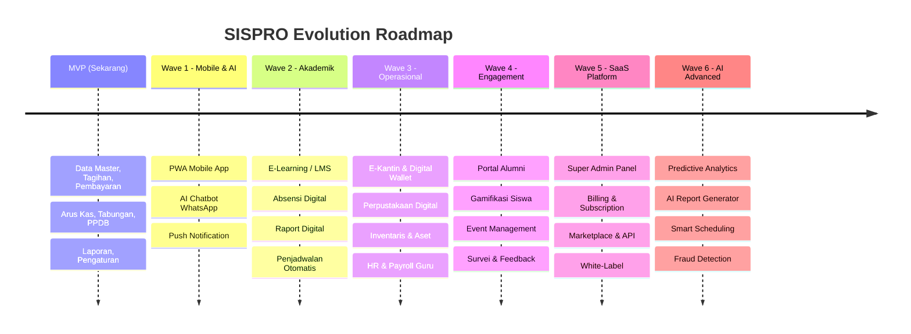
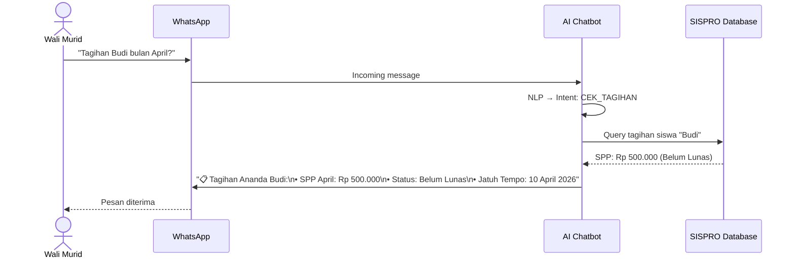
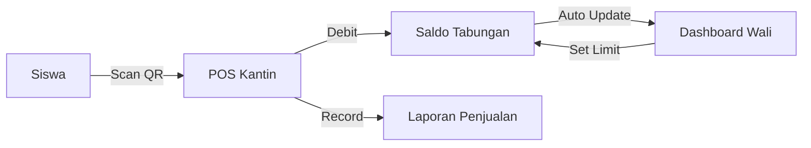

# 🚀 SISPRO — Roadmap Fitur Masa Depan

> Hasil riset fitur tambahan untuk pengembangan jangka panjang SISPRO sebagai platform SaaS Edukasi terdepan di Indonesia.

---

## Ringkasan Roadmap

Fitur-fitur ini dibagi menjadi **6 gelombang pengembangan** setelah MVP selesai, dengan prioritas berdasarkan **nilai bisnis** dan **kompleksitas teknis**.



---

## 🌊 Wave 1: Mobile & AI Foundation

### 📱 1.1 Progressive Web App (PWA)
> **Prioritas: 🔴 TINGGI** | **Effort: Medium** | **Revenue Impact: Tinggi**

Aplikasi mobile tanpa perlu download dari app store.

| Fitur | Detail |
|:--|:--|
| **Offline Mode** | Akses data tagihan & info siswa tanpa internet |
| **Push Notification** | Notifikasi real-time: tagihan jatuh tempo, pengumuman, PPDB |
| **Install to Homescreen** | Terasa seperti app native di HP |
| **Camera Access** | Scan QR tabungan, upload berkas PPDB |
| **Responsive First** | Optimasi untuk layar 4" hingga tablet |

```
💡 Kenapa PWA, bukan Native App?
├── Satu codebase (Next.js sudah support PWA)
├── Tidak perlu bayar $99/tahun ke Apple/Google
├── Update instan tanpa download ulang
└── Lebih murah & cepat dikembangkan
```

---

### 🤖 1.2 AI Chatbot WhatsApp
> **Prioritas: 🔴 TINGGI** | **Effort: Medium** | **Revenue Impact: Sangat Tinggi**

Bot WhatsApp cerdas yang bisa melayani wali murid 24/7.

| Kemampuan | Contoh Interaksi |
|:--|:--|
| **Cek Tagihan** | "Berapa tagihan Ananda Budi bulan ini?" → Bot kirim rincian |
| **Cek Saldo Tabungan** | "Saldo tabungan Ananda?" → Bot kirim saldo + riwayat |
| **Status PPDB** | "Status pendaftaran No. 00123?" → Bot kirim status + berkas |
| **Pengingat Otomatis** | Bot otomatis kirim reminder H-7, H-3, H-1 jatuh tempo |
| **Bukti Pembayaran** | Wali kirim bukti transfer → Bot forward ke admin untuk verifikasi |
| **FAQ Otomatis** | Jam operasional, rekening, kontak, dll → Auto-reply |



---

### 🔔 1.3 Smart Notification Center
> **Prioritas: 🔴 TINGGI** | **Effort: Low** | **Revenue Impact: Medium**

| Channel | Fitur |
|:--|:--|
| **In-App** | Bell icon dengan badge count, notification drawer |
| **Push (PWA)** | Browser push notification untuk event penting |
| **WhatsApp** | Template message untuk tagihan, pembayaran, PPDB |
| **Email** | Digest harian/mingguan untuk admin & wali |
| **Telegram** | Alternatif channel (opsional) |

---

## 🌊 Wave 2: Modul Akademik

### 📚 2.1 E-Learning / LMS Mini
> **Prioritas: 🟡 MEDIUM** | **Effort: High** | **Revenue Impact: Tinggi**

| Fitur | Detail |
|:--|:--|
| **Kelas Virtual** | Buat kelas online, assign siswa & guru |
| **Materi Pelajaran** | Upload PDF, video, link YouTube per mata pelajaran |
| **Tugas & PR** | Buat tugas, deadline, upload jawaban siswa |
| **Quiz Online** | Pilihan ganda, essay, auto-grading untuk PG |
| **Forum Diskusi** | Tanya-jawab per kelas/mata pelajaran |
| **Integrasi Google Meet/Zoom** | Link meeting langsung dari dashboard |
| **Progress Tracking** | Visualisasi kemajuan belajar per siswa |

---

### 📋 2.2 Absensi Digital
> **Prioritas: 🔴 TINGGI** | **Effort: Medium** | **Revenue Impact: Tinggi**

| Metode | Detail |
|:--|:--|
| **QR Code** | Siswa scan QR di gerbang/kelas via HP |
| **Face Recognition** | Kamera di gerbang dengan AI face detection |
| **RFID/NFC Card** | Kartu siswa tap di reader |
| **Manual + GPS** | Guru input manual dengan lokasi terverifikasi |
| **Notifikasi Wali** | Auto-notify wali jika anak tidak hadir |
| **Rekap & Laporan** | Statistik per siswa, kelas, bulan |

---

### 📊 2.3 Raport Digital
> **Prioritas: 🟡 MEDIUM** | **Effort: Medium** | **Revenue Impact: Medium**

| Fitur | Detail |
|:--|:--|
| **Input Nilai** | Guru input nilai per mata pelajaran + kompetensi |
| **Kurikulum Merdeka** | Support format raport kurikulum terbaru |
| **Deskripsi Capaian** | AI-assist generate deskripsi capaian pembelajaran |
| **Cetak PDF** | Template raport resmi, customizable per sekolah |
| **Akses Wali** | Wali bisa lihat raport langsung di portal |
| **Histori Akademik** | Riwayat nilai dari semester ke semester |

---

### 📅 2.4 Penjadwalan Otomatis
> **Prioritas: 🟡 MEDIUM** | **Effort: High** | **Revenue Impact: Medium**

| Fitur | Detail |
|:--|:--|
| **Jadwal Pelajaran** | Auto-generate jadwal tanpa konflik guru & ruangan |
| **Kalender Akademik** | Event, libur, ujian, PPDB dalam 1 kalender |
| **Jadwal Ujian** | Generate jadwal ujian dengan pengawas & ruangan |
| **Substitusi Guru** | Auto-suggest pengganti jika guru berhalangan |
| **Sinkron Google Calendar** | Export ke Google Calendar / iCal |

---

## 🌊 Wave 3: Modul Operasional

### 🍽️ 3.1 E-Kantin (Digital Canteen)
> **Prioritas: 🟡 MEDIUM** | **Effort: High** | **Revenue Impact: Sangat Tinggi**

Sistem kantin cashless terintegrasi dengan tabungan siswa.

| Fitur | Detail |
|:--|:--|
| **Scan QR Bayar** | Siswa scan QR di kantin → saldo tabungan terpotong |
| **Menu Digital** | Daftar menu harian dengan harga |
| **Pre-Order** | Siswa pesan makanan dari HP sebelum istirahat |
| **Spending Limit** | Wali set batas belanja harian anak |
| **Riwayat Belanja** | Wali pantau pengeluaran anak di kantin |
| **Dashboard Kantin** | Penjualan harian, menu populer, omzet |
| **Integrasi Tabungan** | Saldo tabungan SISPRO = saldo E-Kantin |



---

### 📖 3.2 Perpustakaan Digital
> **Prioritas: 🟢 RENDAH** | **Effort: Medium** | **Revenue Impact: Low**

| Fitur | Detail |
|:--|:--|
| **Katalog Buku** | Database buku dengan barcode/QR |
| **Peminjaman/Pengembalian** | Scan barcode untuk tracking |
| **E-Book** | Upload & baca ebook dalam browser |
| **Denda Otomatis** | Auto-hitung denda keterlambatan |
| **Reservasi** | Siswa request buku yang sedang dipinjam |
| **Laporan Sirkulasi** | Statistik peminjaman |

---

### 🏢 3.3 Inventaris & Manajemen Aset
> **Prioritas: 🟢 RENDAH** | **Effort: Medium** | **Revenue Impact: Medium**

| Fitur | Detail |
|:--|:--|
| **Database Aset** | Semua properti sekolah (komputer, meja, AC, dll) |
| **QR/Barcode Label** | Cetak label untuk setiap aset |
| **Pemeliharaan** | Jadwal maintenance, tiket perbaikan |
| **Depresiasi** | Hitung penyusutan nilai aset otomatis |
| **Peminjaman Aset** | Guru/staf pinjam projector, dll → tracking |
| **Laporan Kondisi** | Baik, rusak ringan, rusak berat, dibuang |

---

### 👨‍🏫 3.4 HR & Payroll Guru/Staf
> **Prioritas: 🟡 MEDIUM** | **Effort: High** | **Revenue Impact: Tinggi**

| Fitur | Detail |
|:--|:--|
| **Data Kepegawaian** | Profil lengkap guru & staf |
| **Absensi Staf** | Check-in/out digital, rekap hadir |
| **Cuti & Izin** | Pengajuan cuti online, approval workflow |
| **Penggajian** | Hitung gaji, tunjangan, potongan otomatis |
| **Slip Gaji** | Generate & kirim slip gaji digital |
| **Pajak (PPh 21)** | Kalkulasi pajak otomatis |
| **Evaluasi Kinerja** | Form evaluasi periodik, KPI tracking |
| **Integrasi Arus Kas** | Gaji masuk otomatis ke pengeluaran |

---

## 🌊 Wave 4: Engagement & Community

### 🎓 4.1 Portal Alumni
> **Prioritas: 🟢 RENDAH** | **Effort: Medium** | **Revenue Impact: Medium**

| Fitur | Detail |
|:--|:--|
| **Database Alumni** | Otomatis dari data siswa yang lulus |
| **Profil & Karir** | Alumni update status karir mereka |
| **Direktori Alumni** | Cari alumni per angkatan, jurusan |
| **Event & Reuni** | Buat & kelola event reuni |
| **Donasi** | Portal donasi alumni untuk sekolah |
| **Testimoni** | Alumni bisa post testimoni untuk PPDB |
| **Networking** | Alumni bisa connect satu sama lain |

---

### 🎮 4.2 Gamifikasi Siswa
> **Prioritas: 🟢 RENDAH** | **Effort: Medium** | **Revenue Impact: Medium**

| Fitur | Detail |
|:--|:--|
| **Poin & Badge** | Raih poin dari kehadiran, nilai, tugas tepat waktu |
| **Leaderboard** | Ranking per kelas & sekolah |
| **Achievement System** | "Hadir 30 Hari Berturut-turut! 🏆" |
| **Reward Store** | Tukar poin dengan reward (kantin, merchandise) |
| **Streak System** | "🔥 7 hari tanpa terlambat!" |
| **Challenge** | Tantangan mingguan dari guru |

---

### 🎪 4.3 Event Management
> **Prioritas: 🟢 RENDAH** | **Effort: Low** | **Revenue Impact: Low**

| Fitur | Detail |
|:--|:--|
| **Buat Event** | Rapat wali, pentas seni, class meeting, dll |
| **RSVP Digital** | Konfirmasi kehadiran online |
| **Tiket Event** | QR code tiket untuk event berbayar |
| **Dokumentasi** | Gallery foto & video per event |
| **Notifikasi** | Reminder otomatis ke peserta |

---

### 📝 4.4 Survei & Feedback
> **Prioritas: 🟢 RENDAH** | **Effort: Low** | **Revenue Impact: Low**

| Fitur | Detail |
|:--|:--|
| **Survey Builder** | Buat survei kepuasan dengan drag & drop |
| **Target Responden** | Kirim ke wali, siswa, guru per kelas |
| **Analisis Otomatis** | Chart & statistik hasil survei |
| **NPS Score** | Net Promoter Score untuk ukur kepuasan |
| **Feedback Box** | Kotak saran digital anonim |

---

## 🌊 Wave 5: SaaS Platform Full

### 👑 5.1 Super Admin Panel
> **Prioritas: 🔴 TINGGI (untuk SaaS)** | **Effort: High** | **Revenue Impact: Kritis**

Panel untuk mengelola semua tenant (sekolah) dari satu dashboard.

| Fitur | Detail |
|:--|:--|
| **Dashboard Overview** | Total tenant, total siswa, revenue, growth chart |
| **Tenant Management** | Add, suspend, activate, delete tenant |
| **Billing Dashboard** | Tagihan per tenant, payment status, overdue |
| **Usage Monitoring** | Storage, API calls, jumlah siswa per tenant |
| **Support Ticket** | Kelola tiket bantuan dari tenant |
| **Announcement** | Broadcast ke semua tenant |
| **System Health** | Monitoring server, DB, error rate |

---

### 💳 5.2 Billing & Subscription Engine
> **Prioritas: 🔴 TINGGI (untuk SaaS)** | **Effort: High** | **Revenue Impact: Kritis**

| Fitur | Detail |
|:--|:--|
| **Paket Langganan** | Free / Basic / Pro / Enterprise |
| **Payment Gateway** | Midtrans, Xendit, atau Stripe |
| **Auto-Billing** | Invoice otomatis setiap bulan/tahun |
| **Trial Period** | 14 hari trial gratis untuk tenant baru |
| **Usage-Based Add-on** | Tambah kuota siswa, storage, WhatsApp credit |
| **Invoice Management** | Generate, kirim, tracking invoice |
| **Prorate** | Hitung prorata saat upgrade/downgrade |

**Model Pricing yang Direkomendasikan:**

| Paket | Harga/Bulan | Batasan |
|:--|:--|:--|
| **🆓 Starter** | Gratis | ≤50 siswa, 1 unit, fitur dasar |
| **💎 Basic** | Rp 199.000 | ≤200 siswa, 2 unit, +Excel export |
| **🏆 Pro** | Rp 499.000 | ≤500 siswa, 5 unit, +PPDB, +Tabungan, +WA |
| **🏢 Enterprise** | Custom | Unlimited, custom domain, dedicated support |

---

### 🛒 5.3 Marketplace & Plugin System
> **Prioritas: 🟡 MEDIUM** | **Effort: Very High** | **Revenue Impact: Tinggi**

| Fitur | Detail |
|:--|:--|
| **Plugin Architecture** | Modul bisa di-install/uninstall per tenant |
| **Plugin Store** | Marketplace plugin resmi & pihak ketiga |
| **Developer API** | Public REST API untuk integrasi pihak ketiga |
| **API Key Management** | Rate limiting, usage tracking |
| **Webhook** | Notifikasi event ke sistem eksternal |
| **Theme Store** | Tema portal & dashboard tambahan |
| **Revenue Sharing** | Developer dapat 70%, platform 30% |

---

### 🏷️ 5.4 White-Label Solution
> **Prioritas: 🟡 MEDIUM** | **Effort: Medium** | **Revenue Impact: Tinggi**

| Fitur | Detail |
|:--|:--|
| **Custom Domain** | sekolah.sch.id → tanpa branding SISPRO |
| **Custom Logo & Branding** | Logo, favicon, warna, font custom |
| **Custom Email Domain** | noreply@sekolah.sch.id |
| **Branded PDF** | Kwitansi, raport, surat dengan header sekolah |
| **Reseller Program** | Partner bisa jual SISPRO dengan brand mereka |

---

## 🌊 Wave 6: AI & Advanced Analytics

### 🧠 6.1 AI Predictive Analytics
> **Prioritas: 🟡 MEDIUM** | **Effort: Very High** | **Revenue Impact: Tinggi**

| Fitur | Detail |
|:--|:--|
| **Prediksi Tunggakan** | AI prediksi siswa yang berpotensi nunggak bayaran |
| **Prediksi Dropout** | Identifikasi siswa berisiko putus sekolah |
| **Forecasting Pendapatan** | Proyeksi pendapatan sekolah per bulan |
| **Analisis Tren PPDB** | Prediksi jumlah pendaftar tahun depan |
| **Student Risk Score** | Skor risiko akademis per siswa |
| **Budget Recommendation** | AI saran alokasi anggaran optimal |

---

### 📄 6.2 AI Report Generator
> **Prioritas: 🟡 MEDIUM** | **Effort: Medium** | **Revenue Impact: Medium**

| Fitur | Detail |
|:--|:--|
| **Natural Language Reports** | "Buatkan laporan pembayaran SPP Kelas 10 bulan ini" |
| **Auto-Summary** | AI generate ringkasan eksekutif dari data |
| **Anomaly Detection** | Alert jika ada transaksi mencurigakan |
| **Deskripsi Raport** | AI generate capaian pembelajaran per siswa |
| **Insight Dashboard** | AI highlight temuan penting di dashboard |

---

### 🕵️ 6.3 Fraud Detection & Security
> **Prioritas: 🟡 MEDIUM** | **Effort: High** | **Revenue Impact: Medium**

| Fitur | Detail |
|:--|:--|
| **Transaction Monitoring** | Deteksi transaksi ganda/tidak wajar |
| **Login Anomaly** | Alert jika login dari device/IP tidak biasa |
| **Two-Factor Auth (2FA)** | OTP via WhatsApp/SMS untuk login admin |
| **Data Encryption** | Enkripsi field sensitif (NIS, alamat, kontak) |
| **Audit Trail** | Log semua perubahan data dengan before/after |
| **Auto-Backup** | Backup otomatis harian dengan point-in-time recovery |

---

### ♿ 6.4 Accessibility & Internationalization
> **Prioritas: 🟢 RENDAH** | **Effort: Medium** | **Revenue Impact: Medium**

| Fitur | Detail |
|:--|:--|
| **Multi-Language** | Bahasa Indonesia, English, Bahasa Daerah |
| **RTL Support** | Untuk ekspansi ke Timur Tengah |
| **Screen Reader** | ARIA labels, keyboard navigation |
| **High Contrast** | Mode kontras tinggi untuk aksesibilitas |
| **Font Scaling** | Ukuran font bisa diperbesar |

---

## 💰 Revenue Projection per Fitur

| Wave | Fitur Unggulan | Potential Revenue/bulan | Complexity |
|:--|:--|:--|:--|
| 1 | PWA + AI Chatbot WA | ↑ Retensi +30%, churn ↓ | ⭐⭐ |
| 2 | LMS + Absensi + Raport | +Rp 100k/tenant add-on | ⭐⭐⭐ |
| 3 | E-Kantin + HR Payroll | +Rp 150k/tenant add-on | ⭐⭐⭐⭐ |
| 4 | Alumni + Gamifikasi | ↑ Engagement, ↑ Word-of-mouth | ⭐⭐ |
| 5 | SaaS Engine + Marketplace | Revenue multiplier 3-5x | ⭐⭐⭐⭐⭐ |
| 6 | AI Analytics | Premium pricing +Rp 200k/tenant | ⭐⭐⭐⭐ |

---

## 🏆 Competitive Advantage Matrix

| Fitur | SISPRO | AdminSekolah | SchoolPay | Jibas |
|:--|:---:|:---:|:---:|:---:|
| Multi-Tenant SaaS | ✅ | ✅ | ❌ | ❌ |
| PPDB Online | ✅ | ✅ | ❌ | ✅ |
| E-Kantin QR | ✅ | ❌ | ❌ | ❌ |
| AI Chatbot WA | ✅ | ❌ | ❌ | ❌ |
| Tabungan Siswa | ✅ | ❌ | ✅ | ❌ |
| LMS Mini | ✅ | ❌ | ❌ | ✅ |
| HR & Payroll | ✅ | ❌ | ❌ | ❌ |
| Raport Digital | ✅ | ❌ | ❌ | ✅ |
| Plugin Marketplace | ✅ | ❌ | ❌ | ❌ |
| Alumni Portal | ✅ | ❌ | ❌ | ❌ |
| Gamifikasi | ✅ | ❌ | ❌ | ❌ |
| White-Label | ✅ | ❌ | ❌ | ❌ |
| Predictive AI | ✅ | ❌ | ❌ | ❌ |

> 🎯 **SISPRO berpotensi menjadi platform SaaS Edukasi paling lengkap di Indonesia** dengan roadmap ini.

---

## Rekomendasi Prioritas Setelah MVP

```
🔴 Wajib (Wave 1-2):
├── PWA Mobile App
├── AI Chatbot WhatsApp  
├── Absensi Digital
└── Raport Digital

🟡 Penting (Wave 3-4):
├── E-Kantin
├── HR & Payroll
├── Portal Alumni
└── Gamifikasi

🟢 Strategis (Wave 5-6):
├── Super Admin + Billing (SaaS)
├── Marketplace & API
├── AI Predictive Analytics
└── White-Label
```
